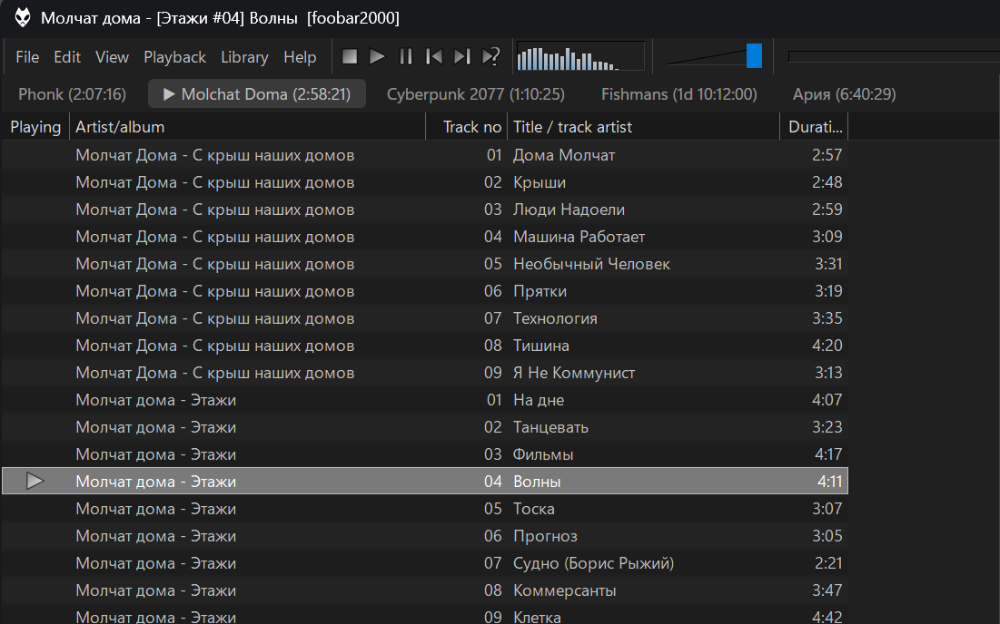

<h1 align="center">foo_enhancedplaylisttabs</h1>

<p align="center">
  Fast, customisable playlist tabs for the <a href="https://www.foobar2000.org/">foobar2000</a> v2 Default UI and Columns UI.<br />
  A replacement for the built-in <b>Playlist Tabs</b>.
</p>

<p align="center">
  
</p>

## Features

- **Works like Playlist Tabs.** A container with one tab per playlist, in playlist order, and one
  hosted element underneath: Playlist View by default in the Default UI, NG Playlist in Columns UI,
  or any other element or panel. Clicking a tab activates its playlist; the hosted element follows
  on its own.
- **Default UI and Columns UI** from the same component, with each UI's colours, fonts and dark
  mode.
- **One strip, no stacked rows.** Tabs that do not fit go to an overflow chevron, and the active tab
  is always kept in view. Titles can be shortened to fit before the chevron appears.
- **Strip on any side.** Top, bottom, left or right. Side strips can rotate their titles.
- **Look.** Underline, pill or text-only indicator, optional chips, corner radius, tab width (fit the
  title, all equal or fill the strip) and alignment, padding and spacing.
- **Accent colour** from the UI selection colour, a custom colour, or the playing track's cover. The
  strip background can follow the UI, be custom, or be tinted with the accent.
- **Titles** are the playlist's name or title formatting, with fields such as `%size%`, `%length%`,
  `%index%`, `%is_playing%` and `%lock_name%`. They update live.
- **Playlist commands** on the tab: new, rename, duplicate, remove, save, load, lock, hide, move.
- **Drag and drop.** Drag tabs to reorder them. Drop files on a tab to add them to that playlist, or
  on empty space for a new playlist named after the folder. Hovering a tab during a drag switches to
  it.
- **Switching.** Click, mouse wheel, Ctrl+Tab / Ctrl+Shift+Tab, the chevron list, or automatically
  when playback starts.
- **Auto-hide.** The strip appears when the pointer reaches a thin hot zone at the edge, over the
  playlist or pushing it aside, with an optional slide or fade.
- **Light on resources.** Nothing runs while idle, a switch repaints two tabs, and adding or
  removing a playlist among hundreds updates one tab. See [Performance](#performance).

## Install

Requires foobar2000 v2 on Windows 7 or later, 32-bit or 64-bit (the package contains both). Works
with the Default UI and with Columns UI; no other components are needed.

1. Download `foo_enhancedplaylisttabs.fb2k-component` from the [latest release](https://github.com/HongYue1/foo_enhancedplaylisttabs/releases/latest).
2. Double-click it, or in foobar2000 open **Preferences > Components > Install...**, and restart.

To remove it, use **Preferences > Components**.

## Use

### Default UI

In layout editing mode (**View > Layout > Enable layout editing mode**), replace or add an element
and pick **Enhanced Playlist Tabs** from *Containers*. It comes with Playlist View inside. To host
another element, right-click it in layout editing mode and use **Replace hosted element...**; **Copy
hosted element** and **Paste as hosted element** work as well.

### Columns UI

In **Preferences > Display > Columns UI > Layout**, add or insert a panel and pick **Enhanced
Playlist Tabs** from *Splitters*. It comes with NG Playlist inside and holds one panel; to host
another, change or remove the panel under it in the layout tree. Live editing (**View > Layout >
Live editing**) works too. Colours and fonts are on the Columns UI **Colours and fonts** page, under
*Enhanced Playlist Tabs*. The Configure dialog opens from the tab menu or the Layout page.
Exporting and importing an FCL keeps the settings and the hosted panel.

### Tab menu

Right-click a tab:

| Item | What it does |
| --- | --- |
| New playlist | Creates "New Playlist", "New Playlist (2)"... after this tab and activates it |
| Rename... | Renames the playlist |
| Duplicate | Copies the playlist as "*name* (copy)" right after it |
| Remove | Removes the playlist (File > Restore brings it back) |
| Save... | Saves the playlist to a file; the name is filled in from the tab, made safe for Windows |
| Load playlist... | Loads a playlist file into a new playlist |
| Lock playlist | Stops tracks from being added, removed or reordered and the playlist from being renamed or removed. Double-click still plays. Kept across restarts. A playlist locked by another component shows **Locked by *name*...** instead |
| Hide tab | Hides the tab; the playlist stays |
| Move left / right | Reorders (up / down on side strips) |
| Show hidden tab | Brings a hidden tab back |
| Appearance | Strip position, active tab, accent colour and strength, strip background, tab width, show strip |
| Configure... | The full settings dialog |

Commands a lock does not allow are greyed out. Right-click empty strip space for **New playlist**,
**Load playlist...**, **Show hidden tab**, **Appearance** and **Configure...**. The chevron opens the
list of playlists; long lists are grouped in submenus of 25.

### Mouse and keyboard

- **Click** a tab to activate its playlist. **Double-click** a tab to rename it (optional) or empty
  space for a new playlist.
- **Middle click** does nothing, hides the tab or removes the playlist (your choice). Removing a
  playlist that has tracks asks first, unless you turn that off.
- **Mouse wheel** over the strip switches to the previous or next tab.
- **Ctrl+Tab / Ctrl+Shift+Tab** cycle the tabs while the keyboard focus is inside the element.
- **Drag** a tab to reorder it, or drag files and tracks onto the strip.

### Configure dialog

Settings belong to each element. Changes show immediately; **Cancel** undoes them and **Defaults**
resets them.

| Page | What is in it |
| --- | --- |
| Strip | Position (top, bottom, left, right); thickness in DIPs (0 = from the font); rotate text on side strips; tab width (fit the title, all equal, fill the strip) and alignment; overflow chevron at the end or the start; shorten titles to fit before showing the chevron; longest title before the ellipsis; padding and spacing |
| Look | Indicator (underline, pill, text only), chips, corner radius, fill strength; accent (UI selection colour, custom, from the playing cover); strip background (UI background, custom, tinted with the accent) and tint strength |
| Titles | The playlist's name or title formatting, with a live preview, examples, the list of fields and **Functions** for the full title formatting reference |
| Behaviour | Show the strip (always, only with two or more playlists, auto-hide, never); animate switches; mouse wheel; drag to reorder; Ctrl+Tab; middle click and whether removing asks first; double-click on empty space and on a tab; what dropping on empty space names the new playlist; switch to the playing playlist when playback starts |
| Auto-hide | Reveal over the playlist (fastest) or push it aside; animation (none, slide, fade) and length; hot zone size; delays before showing and hiding; how long the strip stays after a switch |

### Title fields

| Field | Value |
| --- | --- |
| `%title%`, `%playlist_name%` | The playlist's name |
| `%index%` | Position among the playlists: 1, 2, 3... |
| `%size%`, `%playlist_size%` | Number of tracks |
| `%length%`, `%playlist_duration%` | Total length, such as `1:02:03` (empty for a moment after start-up) |
| `%is_active%` | 1 for the active playlist, else empty |
| `%is_playing%` | 1 for the playlist being played, else empty |
| `%is_locked%` | 1 for a locked playlist (an autoplaylist...), else empty |
| `%lock_name%` | What locks it, such as "Autoplaylist" |

All title formatting functions work. Parentheses, brackets and commas are syntax, so write literal
ones in quotes: `%title% '('%size%')'`. Track fields such as `%artist%` are empty, because a tab has no
track.

### Advanced settings

Preferences > Advanced > Display:

- **Enhanced Playlist Tabs: log performance to the console** prints start-up, switch, paint and
  playlist-change timings. While it is on, the strip-space menu also has **Perf: create 500 test
  playlists** and **Perf: remove the test playlists**.
- **Enhanced Playlist Tabs: wrap tab switches in WM_SETREDRAW (experiment)** is off by default.

## Performance

- **One** playlist callback per process, however many elements exist, registered with
  playlist-level events only. Track events are added only while a title shows `%size%` or
  `%length%`, and are coalesced to one update per playlist per message-loop turn.
- A switch only calls `set_active_playlist` and repaints two tabs. The hosted element is not moved,
  resized or repainted by the strip.
- Creating, removing, renaming, hiding or moving a playlist updates one tab: tabs are keyed by
  playlist, so the other tabs keep their text layouts.
- `%length%` is summed on a CPU worker from cached track info (no file access), so it never holds
  up start-up or the UI.
- No timers, hooks or polling while idle. Auto-hide is event driven; a timer runs only while a delay
  is due, an animation plays or a drag hovers a tab.
- Only the strip is painted: double-buffered, dirty rectangles only, and no heap allocations in
  `WM_PAINT` (checked by the render test).
- Measured with 509 playlists (foobar2000 2.26, x64): playlists read in 17 ms at start-up; one
  playlist created in 0.2 ms (1 text layout built); one removed in 0.02 ms (none built); 500 removed
  in 25 ms; a switch 0.5 ms on the strip's side, warm strip paints under 1.6 ms with no
  allocations.

## Building

Windows, Visual Studio 2022 or later with the *Desktop development with C++* workload.

The project builds against sibling folders rather than vendored copies:

```
some-folder/
  foo_enhancedplaylisttabs/   this repository
  SDK-2026-09-17/             foobar2000 SDK
    columns_ui-sdk/           Columns UI SDK, inside the foobar2000 SDK folder
  wtl/                        WTL (the folder that contains Include/)
```

- foobar2000 SDK: <https://www.foobar2000.org/SDK>
- Columns UI SDK: <https://github.com/reupen/columns_ui-sdk>
- WTL: <https://sourceforge.net/projects/wtl/>

Then, from `foo_enhancedplaylisttabs/`:

```bat
build.bat Release x64      :: builds the SDK libraries and the component, log in build.log
build.bat Release Win32    :: the same for 32-bit, log in build-Win32.log
package.bat                :: builds both, dist\foo_enhancedplaylisttabs.fb2k-component and dist\symbols\ (needs 7-Zip)
```

`build.bat` and `package.bat` assume Visual Studio at `C:\Program Files\Microsoft Visual Studio\18\Community`
and 7-Zip at `C:\Program Files\7-Zip`; edit the paths at the top if yours differ. If your SDK folder
has another name, change `SdkRoot` in `foo_enhancedplaylisttabs.vcxproj` and `SDK` in `build.bat`.
The component links the static C runtime, so users need no redistributable. The build fails if the
DLL imports anything newer than Windows 7, or anything from Columns UI (it must load without it).

To try a build without packaging, copy `x64\Release\foo_enhancedplaylisttabs.dll` to
`%APPDATA%\foobar2000-v2\user-components-x64\foo_enhancedplaylisttabs\` (or
`Win32\Release\foo_enhancedplaylisttabs.dll` to `user-components\foo_enhancedplaylisttabs\` for
32-bit) and restart foobar2000.

### Tests (no foobar2000 needed)

`test\build_tests.bat` builds and runs seven tests:

- `codec_test`: settings survive a round trip, fields from newer versions are kept, damaged data
  falls back to defaults; safe file names for Save.
- `layout_test`: tab positions for each width mode and alignment, and overflow.
- `accent_test`: the accent picked from synthetic covers.
- `render_test`: renders the strip offline, times it, counts allocations in the paint path and
  writes PNGs to `test\out\`.
- `zorder_test`: the window-manager behaviour auto-hide relies on (what does and does not
  report a child moving above the hot zone).
- `model_test`: keyed strip updates with 500 tabs (one created builds one layout; removals, moves
  and hide/show build none).
- `title_test`: which fields a title script uses, and the `%length%` text.

### Source map

| File | Job |
| --- | --- |
| `src/component.cpp` | Component identity, DirectWrite warm-up |
| `src/hosts/dui_element.cpp` | The Default UI container element and its hosted element |
| `src/hosts/cui_container.cpp` | The Columns UI container, its hosted panel, colours and fonts clients |
| `src/hosts/switcher_core.cpp` | Tabs, switching, menus, drag and drop, auto-hide |
| `src/hosts/strip_drop.cpp` | OLE drop target for the strip and the hot zone |
| `src/hosts/configure_dialog.cpp` | The Configure dialog, Rename and the remove confirmation |
| `src/playlists/playlist_model.cpp` | The one playlist callback, per-playlist flags, `%length%` sums |
| `src/playlists/playlist_title.cpp` | The title formatting fields |
| `src/playlists/user_lock.cpp` | Lock playlist |
| `src/model/` | Settings and their storage, accent from the cover, title-field inspection, file names |
| `src/strip/strip_window.cpp` | The strip: drawing, input, tooltips, keyed item updates |
| `src/strip/strip_layout.cpp` | Tab positions and overflow |
| `src/strip/hot_zone.cpp` | The auto-hide hot zone |
| `src/platform/` | Drawing, cover loading and decoding, timing and logging |

Settings are stored in a versioned format that keeps fields it does not know, so adding an option
does not break an existing layout. Per-playlist state (hidden, locked) is stored in a playlist
property, so it travels with the playlist.

## See also

- [foo_bettertabs](https://github.com/HongYue1/foo_bettertabs): the tab container this component's
  strip comes from, for Columns UI and the Default UI.
- [foo_onscreendisplay](https://github.com/HongYue1/foo_onscreendisplay): Highly customizable On-Screen Display for foobar2000.

## License

[MIT](LICENSE)
